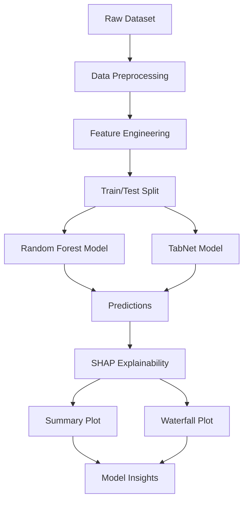

# 🧠 Migraine Classification using Machine Learning


---

## 📌 Overview

This project focuses on **classifying migraine types** using machine learning models and enhancing **model transparency** through explainability techniques.

- 📊 Dataset: 400 patient records  
- 🧾 Features: 24 clinical attributes  
- 🎯 Target: Migraine Type Classification  
- 🔍 Explainability: SHAP (Shapley Additive Explanations)

---

## 🗂️ Dataset Description

The dataset contains both **numerical** and **categorical features** related to migraine symptoms and patient conditions.

### 🔑 Key Features

| Feature | Description |
|--------|------------|
| Age | Patient age (15–77) |
| Duration | Episode duration (1–3 days) |
| Frequency | Monthly occurrence (1–8) |
| Intensity | Pain severity (0–3) |
| Nausea/Vomit | Binary symptoms |
| Phonophobia | Noise sensitivity |
| Photophobia | Light sensitivity |
| Visual/Sensory | Symptom counts |
| DPF | Family history |

### 🎯 Target Classes

- Typical Aura with Migraine  
- Migraine without Aura  
- Typical Aura without Migraine  
- Familial Hemiplegic Migraine  
- Sporadic Hemiplegic Migraine  
- Basilar-Type Aura  
- Other  

---

## ⚙️ Project Architecture



---

## 🤖 Models Used

### 🌲 Random Forest

- Stable and interpretable
- Captures feature interactions effectively
- Consistent feature importance

### 🤖 TabNet

- Deep learning-based architecture
- Instance-wise feature selection
- Highly adaptive but less interpretable

---

## 🔍 Interpretability with SHAP

SHAP is used to explain **how each feature contributes to predictions**.

### 📈 Summary Plot Insights

- High-impact features:
  - Age  
  - Intensity  
  - Frequency  
  - Duration  

- Low interaction:
  - Phonophobia  
  - Photophobia  

---

### 💧 Waterfall Plot Insights

#### Random Forest
- 🔼 Positive: Phonophobia  
- 🔽 Negative: Duration, Photophobia  
- Balanced prediction outcome

#### TabNet
- 🔼 Positive: Age  
- 🔽 Negative: Intensity, DPF  
- Dynamic feature importance per instance

---

## 📊 Key Insights

| Model | Strength | Limitation |
|------|--------|-----------|
| Random Forest | Stable & interpretable | Less adaptive |
| TabNet | Personalized predictions | Harder to interpret |

---

## 🚀 How to Run

```bash
git clone https://github.com/musman1993//migraine-classification.git
cd migraine-classification
pip install -r requirements.txt
python train.py
python shap_analysis.py
```

---

## 📁 Project Structure

```bash
├── data/
├── notebooks/
├── models/
├── src/
│   ├── preprocessing.py
│   ├── train.py
│   ├── evaluate.py
│   └── shap_analysis.py
├── outputs/
│   ├── plots/
│   └── reports/
├── requirements.txt
└── README.md
```

---

## 📌 Future Improvements

- 📈 Hyperparameter tuning
- 🧪 Cross-validation enhancements
- 🌐 Deployment (API / Dashboard)
- 🧠 Integration with clinical decision systems

---

## 🤝 Contributing

Contributions are welcome! Please fork the repo and submit a pull request.

---

## 📜 License

This project is licensed under the **MIT License**.

---

## 👤 Author

**Muhammad Usman**  
📧 Open to collaborations in **AI, Data Analytics, and Healthcare ML**
